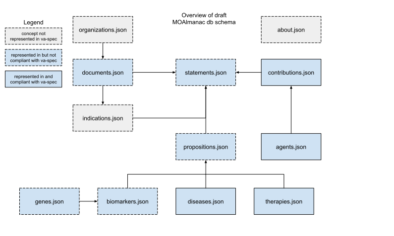

# Documentation assets
The following assets are used by documentation within the `docs/` folder of this repository.

# Table of contents
- [Database schema diagram](#database-schema-diagram)

# Assets
## Database schema diagram
[moalmanac-db-schema-diagram.svg](moalmanac-db-schema-diagram.svg) is a diagram of the database schema. Here, we aim to highlight: 
1. Connections between the [different references between files that make up the database](../../references/)
2. What parts of our schema is represented within [GA4GH's va-spec](https://github.com/ga4gh/va-spec)
3. What parts of our schema are compliant with va-spec

This diagram was created with [Google Draw](https://docs.google.com/drawings/d/1fLOOwtc87YVEJfy4oTiP04cUFgKVGalv8vv4k0L__2c/edit?usp=sharing).

[Back to table of contents](#table-of-contents)